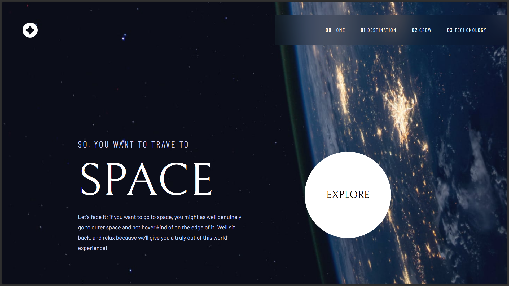

# Frontend Mentor - Space tourism website solution

This is a solution to the [Space tourism website challenge on Frontend Mentor](https://www.frontendmentor.io/challenges/space-tourism-multipage-website-gRWj1URZ3). Frontend Mentor challenges help you improve your coding skills by building realistic projects.

## Table of contents

- [Frontend Mentor - Space tourism website solution](#frontend-mentor---space-tourism-website-solution)
  - [Table of contents](#table-of-contents)
  - [Overview](#overview)
    - [The challenge](#the-challenge)
    - [Screenshot](#screenshot)
    - [Links](#links)
  - [My process](#my-process)
    - [Built with](#built-with)
    - [What I learned](#what-i-learned)
    - [Continued development](#continued-development)
  - [Author](#author)

## Overview

### The challenge

Users should be able to:

- View the optimal layout for each of the website's pages depending on their device's screen size
- See hover states for all interactive elements on the page
- View each page and be able to toggle between the tabs to see new information

### Screenshot

### Links

- Solution URL: [Solution on Frontend Mentor](https://www.frontendmentor.io/solutions/space-tourism-website-solution-XIeev4n06G)
- Live Site URL: [https://fm-space-tourism-solution.vercel.app/](https://fm-space-tourism-solution.vercel.app/)

## My process

My typical process involves reviewing the design files provided and then building out the components mobile-first, gradually adding styles for tablet and desktop views.

### Built with

- [Next.js](https://nextjs.org/) - React framework
- [TypeScript](https://www.typescriptlang.org/) - JavaScript superset
- [Tailwind CSS](https://tailwindcss.com/) - Utility-first CSS framework
- Semantic HTML5 markup
- CSS custom properties
- Flexbox
- Mobile-first workflow

### What I learned

During this project, I reinforced my skills in building responsive layouts and implementing a multi-page navigation structure with Next.js.

### Continued development

I plan to continue developing this project by:
- Implementing the remaining styles, such as the horizontal line in the navbar for the desktop view.
- Adding smooth animation effects. I am currently learning Framer Motion and intend to integrate animations as I progress.

## Author

- Name - Md Talim
- Website - [md-talim.vercel.app](https://md-talim.vercel.app)
- Frontend Mentor - [@Md-Talim](https://www.frontendmentor.io/profile/Md-Talim)
- Twitter - [@talimbuilds](https://twitter.com/talimbuilds)
